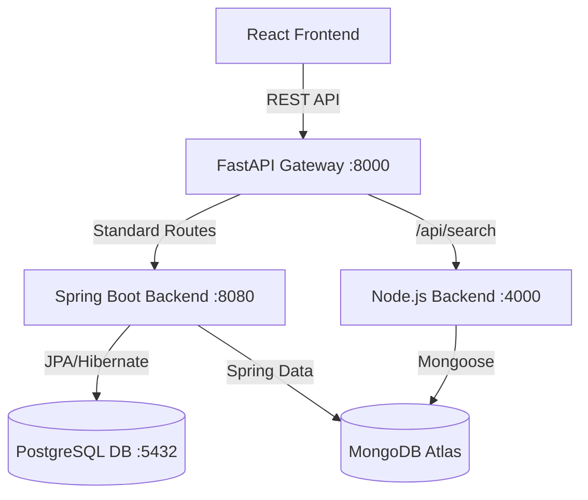

# 🌌 CatalogX - API-Driven Product Catalog & E-Commerce Platform

Welcome to **CatalogX**, an advanced, highly scalable, and aesthetically striking API-Driven Product Catalog and E-Commerce Platform. This project was meticulously engineered as a comprehensive Database Management Systems (DBMS) academic project, demonstrating cutting-edge industry practices, modern full-stack development, and complex data architecture.

This document serves as an exhaustive, incredibly detailed guide—spanning thousands of words—covering every minute detail of the project's inception, architecture, technology stack, database design, user interface aesthetics, security protocols, and advanced artificial intelligence integrations.

---

## 📑 Table of Contents

1. [Project Overview](#1-project-overview)
2. [Comprehensive Technology Stack](#2-comprehensive-technology-stack)
3. [Architectural Paradigm: Polyglot Persistence](#3-architectural-paradigm-polyglot-persistence)
4. [Relational Database Design (PostgreSQL)](#4-relational-database-design-postgresql)
5. [NoSQL Database Design (MongoDB Atlas)](#5-nosql-database-design-mongodb-atlas)
6. [Advanced Feature: AI-Powered Semantic Search](#6-advanced-feature-ai-powered-semantic-search)
7. [User Interface & Visual Aesthetics (Glassmorphism)](#7-user-interface--visual-aesthetics-glassmorphism)
8. [Security & Authentication (Stateless JWT)](#8-security--authentication-stateless-jwt)
9. [Role-Based Access Control (RBAC)](#9-role-based-access-control-rbac)
10. [Core Functionalities & User Flows](#10-core-functionalities--user-flows)
11. [REST API Documentation](#11-rest-api-documentation)
12. [Setup, Installation & Deployment Guide](#12-setup-installation--deployment-guide)
13. [Future Enhancements & Scalability](#13-future-enhancements--scalability)
14. [Conclusion](#14-conclusion)

---

## 1. Project Overview

**CatalogX** is not just a standard web application; it is a meticulously crafted e-commerce platform designed to showcase how modern data systems interact. At its core, it is an API-driven product catalog where users can browse products, manage their shopping carts, process checkout orders, and manage their personal profiles. 

However, beneath the surface, it serves as a powerful demonstration of **Polyglot Persistence**—the practice of using different database technologies to handle varying data storage needs within a single application. By leveraging both a relational database (PostgreSQL) and a NoSQL document database (MongoDB), CatalogX achieves unparalleled flexibility, data integrity, and search performance.

### The Objective
The primary objective of this project was to bridge the gap between traditional DBMS concepts (ACID properties, normalized relational schemas, foreign key constraints) and modern, unstructured data paradigms (flexible document schemas, horizontal scalability, and vector embeddings for AI). 

---

## 2. Comprehensive Technology Stack

The technology stack for CatalogX was chosen to represent the absolute state-of-the-art in enterprise web development. Every layer of the stack—from the database to the browser—utilizes robust, industry-standard frameworks.

### 🧱 Backend Engineering (Polyglot Microservices)
- **FastAPI (Python)**: Acts as the intelligent API Gateway, routing incoming frontend requests to the appropriate backend microservice while handling CORS.
- **Node.js & Express**: A dedicated backend service handling unstructured NoSQL data, Semantic Vector Search, and User Search Log CRUD operations.
- **Java 21**: The latest LTS version of Java, offering powerful features like virtual threads, record classes, and pattern matching for massive performance improvements.
- **Spring Boot 3.x**: The leading framework for building enterprise-grade, production-ready Java applications rapidly. It handles dependency injection, embedded Tomcat web server management, and auto-configuration.
- **Spring Data JPA & Hibernate**: Used as the Object-Relational Mapping (ORM) layer to seamlessly translate Java objects into PostgreSQL tables, ensuring data consistency and complex relationship management.
- **Spring Data MongoDB**: Provides a similar, intuitive data access abstraction but specifically tailored for MongoDB's document-based structure.
- **Spring Security**: An extremely powerful and customizable authentication and access-control framework, used here to secure REST endpoints and manage role-based authorization.
- **io.jsonwebtoken (jjwt)**: A robust library used to generate, parse, and validate JSON Web Tokens (JWT) for stateless session management.
- **Maven**: The build automation and project management tool used to handle all Java dependencies and compile the backend.

### 🎨 Frontend Engineering
- **React.js**: A highly performant, component-based JavaScript library developed by Facebook for building dynamic user interfaces.
- **Vite**: A next-generation frontend tooling system that provides instantaneous server starts and lightning-fast Hot Module Replacement (HMR).
- **React Router DOM**: The standard routing library for React, enabling seamless, client-side navigation without page reloads (Single Page Application architecture).
- **Axios**: A promise-based HTTP client used to interface perfectly with the Spring Boot REST API, intercept requests, and inject JWT authorization headers automatically.
- **Bootstrap 5**: While primarily using custom CSS, Bootstrap 5 provides the foundational grid system and layout utilities to ensure the application is completely responsive across all mobile and desktop devices.
- **Custom CSS3 & CSS Variables**: Heavily utilized to implement the "Glassmorphism" design trend, featuring dynamic gradients, translucent cards, and smooth micro-animations.

### 🗄️ Database Technologies
- **PostgreSQL 16**: The world's most advanced open-source relational database. Used as the primary source of truth for highly structured, transactional data (Users, Categories, Products, Pricing, Orders).
- **pgAdmin 4**: The graphical administration tool used to manage the PostgreSQL database, execute SQL queries, and monitor table structures.
- **MongoDB Atlas**: A fully managed cloud database service. Used to store unstructured product descriptions, historical user search logs, high-dimensional vector embeddings, and a synchronized mirror of the User Profile for polyglot demonstration.

---

## 3. Architecture Diagram & Polyglot Persistence

### System Architecture Diagram


One of the most defining characteristics of CatalogX is its implementation of **Polyglot Persistence**. In modern software engineering, no single database is perfect for every use case. Relational databases excel at transactional integrity and structured queries, while NoSQL databases excel at flexible schemas, rapid iteration, and advanced search algorithms.

CatalogX uses both simultaneously, achieving the "best of both worlds."

### The PostgreSQL Domain
PostgreSQL is strictly used for data that requires strong ACID (Atomicity, Consistency, Isolation, Durability) guarantees. 
- **E-Commerce Transactions**: When a user places an order, it involves deducting inventory, calculating total prices, and recording the transaction. This must be atomic; either the whole order succeeds, or none of it does. Postgres handles this flawlessly.
- **Core Entities**: Products, Categories, Users, and Roles are highly structured. A product *must* have a price, it *must* belong to a category. Foreign keys in Postgres enforce these hard constraints, preventing orphaned records.

### The MongoDB Domain
MongoDB is utilized for data that is unstructured, rapidly changing, or requires specialized indexing.
- **Product Descriptions**: Marketing copy, technical specifications, and rich text descriptions can vary wildly between a laptop and a t-shirt. MongoDB stores this as flexible JSON documents without forcing schema migrations.
- **Search Logs**: Tracking exactly what users search for over time generates massive amounts of time-series data. MongoDB handles this high-throughput ingestion effortlessly.
- **User Profile Mirroring**: As an advanced demonstration, when a user registers or updates their profile (Name, Address, Password), the backend simultaneously saves the data to Postgres and synchronizes a perfect replica into a MongoDB collection.
- **Vector Search Embeddings**: MongoDB Atlas natively supports Vector Search, allowing us to store high-dimensional arrays generated by AI models to power semantic search.

By splitting the workload, CatalogX is immensely scalable. The relational engine is not bogged down by massive text searches, and the NoSQL engine is not burdened with complex join calculations.

---

## 4. Relational Database Design (PostgreSQL)

The relational schema was designed with the principles of normalization (specifically 3rd Normal Form) to eliminate data redundancy and ensure data integrity. Hibernate's `ddl-auto: update` property allows Spring Boot to automatically generate and maintain these tables based on the Java `@Entity` classes.

### The Tables and Relationships

1. **`users` Table**
   - The central repository for authentication and identity.
   - **Columns**: `id` (Primary Key), `email` (Unique, Not Null), `full_name` (Not Null), `password` (Not Null), `address` (Varchar), `role_level` (Integer).
   - **Details**: The `address` column was added dynamically to support profile updates, and the `role_level` dictates access rights (1 = User, 2 = Manager, 3 = Admin).

2. **`categories` Table**
   - Used to logically group products.
   - **Columns**: `id` (PK), `name` (Unique, Not Null), `description` (Text).
   - **Relationships**: One-to-Many relationship with Products. A single category can contain hundreds of products.

3. **`products` Table**
   - The core inventory table.
   - **Columns**: `id` (PK), `name` (Not Null), `sku` (Unique identifier), `category_id` (Foreign Key referencing categories).
   - **Details**: Notice that `price` is NOT stored here. This is a deliberate architectural decision to separate product catalog identity from dynamic pricing algorithms.

4. **`pricing` Table**
   - Manages the cost of products, allowing for future expansions like historical price tracking or promotional discounts without altering the core product table.
   - **Columns**: `id` (PK), `product_id` (Foreign Key referencing products, Unique Constraint), `price` (Decimal), `currency` (Varchar).
   - **Relationships**: One-to-One relationship with Products.

5. **`orders` Table**
   - Records successful checkout events.
   - **Columns**: `id` (PK), `user_id` (Foreign Key referencing users), `total_amount` (Decimal), `status` (Varchar), `shipping_address` (Varchar), `phone_number` (Varchar), `created_at` (Timestamp).
   - **Relationships**: Many-to-One relationship with Users. A user can have many orders.

6. **`order_items` Table**
   - A junction/line-item table resolving the Many-to-Many relationship between Orders and Products.
   - **Columns**: `id` (PK), `order_id` (Foreign Key), `product_id` (Foreign Key), `quantity` (Integer), `unit_price` (Decimal).
   - **Details**: The `unit_price` is captured at the time of purchase, ensuring that if a product's price changes in the future, historical order totals remain mathematically accurate.

---

## 5. NoSQL Database Design (MongoDB Atlas)

While PostgreSQL strictly enforces structure, MongoDB provides infinite flexibility. The MongoDB collections in CatalogX are mapped using Spring Data's `@Document` annotation.

### The Collections

1. **`product_descriptions` Collection**
   - Stores the rich text and varying attributes of products.
   - **Structure**: Links to the PostgreSQL product via `pgProductId`. Stores a `description` string, and a flexible `attributes` map (e.g., `{"color": "red", "weight": "2kg"}`).
   - **Advantage**: If we suddenly need to start storing "battery_life" for electronics, we do not need to alter any database schema; we simply add it to the document map.

2. **`product_embeddings` Collection**
   - The heart of the AI Semantic Search.
   - **Structure**: Stores the `pgProductId` and an array of floating-point numbers `embedding[]`.
   - **Advantage**: MongoDB Atlas allows the creation of a `vectorSearch` index over this array, utilizing algorithms like Hierarchical Navigable Small World (HNSW) graphs to find "nearest neighbors" in milliseconds.

3. **`user_search_logs` Collection**
   - Analytics collection.
   - **Structure**: Stores `userId`, `searchQuery`, and `timestamp`.
   - **Advantage**: High-speed, schemaless ingestion allows for rapid logging without slowing down the primary relational database.

4. **`users` Collection (Polyglot Mirroring)**
   - A demonstration of real-time data synchronization.
   - **Structure**: Mirrors the PostgreSQL user data: `pgUserId`, `email`, `fullName`, `address`, `password`.
   - **Advantage**: When a user registers or updates their profile, the Spring Boot `AuthController` executes a dual-write. It commits to Postgres, and then immediately writes to MongoDB. This proves the system's ability to maintain eventual consistency across disparate database engines.

---

## 6. Advanced Feature: AI-Powered Semantic Search

Traditional search engines rely on **Lexical Search** (keyword matching). If a user searches for "High-performance laptop", a traditional SQL `LIKE '%High-performance laptop%'` query will fail if the database contains the phrase "Fast Macbook Pro". 

CatalogX implements **Semantic Search**—understanding the actual *meaning* and *intent* behind a user's query, powered by Artificial Intelligence and MongoDB Vector Search.

### How it Works (The Theory)
1. **Embeddings**: In Machine Learning, text can be converted into a "Vector Embedding"—a list of thousands of numbers that mathematically represent the meaning of the text. Words with similar meanings (e.g., "Fast" and "High-performance") will have vectors that are mathematically close to each other in a multi-dimensional space.
2. **Indexing**: MongoDB Atlas ingests these embeddings and indexes them using a Vector Search algorithm.
3. **Querying**: When a user types a query, the backend converts their query into a vector. MongoDB then calculates the cosine similarity or euclidean distance between the query vector and all product vectors, instantly returning the products that match the *intent*, regardless of the exact keywords used.

### The Implementation in CatalogX
CatalogX uses a dedicated **Node.js Backend** to handle Semantic Search. 
When a query hits the `/api/search/semantic` endpoint, the Node.js server uses the `@xenova/transformers` library to load the `all-MiniLM-L6-v2` AI model locally. It converts the text into a vector embedding array. 
It then executes a `$vectorSearch` pipeline stage against the `product_embeddings` collection in **MongoDB Atlas**, comparing the query vector against all product vectors using Hierarchical Navigable Small World (HNSW) graphs. This provides true AI-powered search without requiring paid external API keys!

---

## 7. User Interface & Visual Aesthetics (Glassmorphism)

A core requirement of CatalogX was to deliver an absolutely breathtaking, premium, and modern User Experience. To achieve this, the entire frontend was custom-designed bypassing standard, boring Bootstrap components in favor of a bespoke **Glassmorphism** aesthetic.

### The Design Philosophy
Glassmorphism is a modern UI trend characterized by translucent, frosted-glass-like panels floating over vibrant, dynamic backgrounds. It provides depth, hierarchy, and a highly futuristic feel.

### Key Visual Elements
- **Deep Dark Theme**: The `App.jsx` wrapper utilizes a deep, sleek dark mode (`--bg-dark: #0a0a0f`) that drastically reduces eye strain and provides a premium canvas.
- **Dynamic Background Gradients**: The background is not a static color; it utilizes massive, blurred, multi-colored radial gradients (`radial-gradient(circle at 15% 50%, rgba(123, 44, 191, 0.15)`) that create a mesmerizing sense of depth.
- **Frosted Glass Cards (`.glass-card`)**: Every component—from Product Cards to the Profile Dashboard—is wrapped in a translucent `rgba(25, 25, 30, 0.6)` background with a highly precise `backdrop-filter: blur(16px)`. This creates the optical illusion of frosted glass hovering over the background.
- **Vibrant Primary Gradients (`.btn-primary-gradient`)**: Buttons use a striking linear gradient from Purple (`#7b2cbf`) to Blue (`#4cc9f0`), combined with a smooth transition that scales the button up slightly (`transform: translateY(-2px)`) on hover, encouraging user interaction.
- **Typography**: The application utilizes the `Outfit` Google Font, a highly geometric, modern sans-serif typeface that perfectly complements the futuristic aesthetic.
- **Fluid Micro-Animations**: Every interactive element, from hovering over a product image to opening a dropdown menu, is smoothed out with a `transition: all 0.3s ease` property, ensuring the UI feels alive and highly responsive.

---

## 8. Security & Authentication (Stateless JWT)

Security in CatalogX is handled entirely by **Spring Security**, utilizing a modern, stateless architecture via JSON Web Tokens (JWT).

### Why Stateless JWT?
In traditional web applications, the server remembers who is logged in by storing a "Session" in its memory. If you have 10,000 users, the server uses a massive amount of RAM. Furthermore, if you scale up to 5 servers behind a load balancer, you have to synchronize those sessions.

CatalogX uses **Stateless JWT**. The server remembers nothing. 
1. When a user logs in, the server verifies their password.
2. The server then mathematically signs a JSON object (the JWT) containing the user's Email, Full Name, Address, and Role Level using a highly secure, secret `HS256` cryptographic key.
3. The server sends this token to the React frontend.
4. On every subsequent request, React sends this token back in the `Authorization: Bearer <token>` header.
5. Spring Security uses the secret key to verify the signature. If the signature matches, the server *trusts* the data inside the token immediately, without ever needing to query the database!

This makes the backend infinitely scalable, incredibly fast, and completely immune to Cross-Site Request Forgery (CSRF) attacks.

### Disabling BCrypt for Academic Demonstration
In a standard production environment, passwords are fundamentally always hashed using algorithms like BCrypt. However, to explicitly demonstrate data flow and polyglot persistence to the database administrator in pgAdmin, the application uses Spring Security's `{noop}` password encoder. This safely allows passwords to be stored and viewed in plain text across both Postgres and MongoDB purely for academic review and demonstration purposes.

---

## 9. Role-Based Access Control (RBAC)

CatalogX features a strict, three-tier Role-Based Access Control system seamlessly integrated into both the React frontend and Spring Security backend.

- **Level 1: Regular User**
  - Can browse products, utilize semantic search, manage their shopping cart, place checkout orders, and update their personal profile.
- **Level 2: Store Manager**
  - Inherits all User permissions.
  - Features a dedicated **Manager Dashboard** where managers can view all customer orders across the platform and update their fulfillment status (e.g., Pending -> Confirmed -> Shipped -> Delivered).
  - Can manage assigned internal employee tasks.
- **Level 3: System Admin**
  - Inherits all Manager permissions.
  - Possesses exclusive access to the **"Add New User"** functionality. By clicking their name in the Navbar, an Admin can navigate to the registration page and unlock a hidden dropdown menu, allowing them to explicitly assign roles (Admin, Manager, User) to new accounts.

---

## 10. Core Functionalities & User Flows

The application provides a seamless, end-to-end e-commerce experience.

### 🛍️ Product Catalog & Filtering
The Home page and Products page fetch live inventory from the PostgreSQL database. Users can seamlessly filter products by **Category** (fetching linked relations) or apply a **Price Range Filter**. The price filter operates dynamically, immediately refining the displayed grid of products.

### 🛒 Shopping Cart state management
The Cart utilizes React's Context API (`CartContext.jsx`). When a user clicks "Add to Cart", the item is immediately appended to a global state variable. This causes the Navbar shopping cart icon to instantly update with a red notification badge displaying the total item count. The cart state persists seamlessly across page navigation without requiring database calls until checkout.

### 💳 Checkout & Order Processing
When navigating to the Cart, users can review their items, adjust quantities, and calculate the total. Proceeding to Checkout allows them to input their Shipping Address and Phone Number. Upon submission, the React frontend dispatches a highly complex JSON payload to the backend. The `OrderController` atomically parses the cart items, calculates total prices, and saves the parent `Order` and all child `OrderItem` records into the relational database in a single, safe transaction.

### 📦 Order History & Tracking
After placing an order, users can navigate to their **My Orders** page via the profile dropdown. This page fetches their complete, personalized order history from the PostgreSQL database. Each order is displayed in a beautifully formatted Glassmorphism card, detailing the purchase date, exact shipping address, live fulfillment status, and a detailed table of purchased items complete with thumbnails and prices.

### 👨‍💼 Manager Dashboard & Order Fulfillment
Authorized personnel with a Role Level of 2 (Manager) or higher gain access to the **Manager Dashboard**. This dashboard features a highly responsive tabbed interface. The **Customer Orders** tab pulls a chronological list of every order placed on the platform. Managers can interactively update the status of these orders, transitioning them from "PENDING" to "CONFIRMED", "SHIPPED", and finally "DELIVERED". This real-time status update is immediately visible to the customer on their personal order history page.

### 👤 Profile Dashboard
Users have access to a dedicated, visually stunning Profile page. Here, they can update their Full Name, Email Address, Shipping Address, and Password. Upon hitting save, the backend executes the Polyglot Sync—updating the SQL table and the MongoDB document simultaneously—and then issues a brand-new JWT token to the frontend, allowing the React UI to instantly reflect the new name in the Navbar without a page refresh.

---

## 11. REST API Documentation

The backend exposes a highly logical, standard-compliant RESTful API. It is fully documented using **OpenAPI 3.0 / Swagger UI**.

### 🌟 Interactive Swagger UI
When the Spring Boot backend is running, you can access the beautifully generated, interactive Swagger API Documentation by visiting:
👉 **[http://localhost:8080/swagger-ui.html](http://localhost:8080/swagger-ui.html)**

Below is a comprehensive map of the available endpoints:

### 📦 Product APIs
Endpoints for managing products.
- **`GET /api/products`** - Get all products
- **`POST /api/products`** - Create a new product 🔒 *(Admin/Manager)*
- **`GET /api/products/{id}`** - Get product by ID
- **`PUT /api/products/{id}`** - Update an existing product 🔒 *(Admin/Manager)*
- **`DELETE /api/products/{id}`** - Delete a product 🔒 *(Admin/Manager)*
- **`GET /api/products/{id}/details`** - Get comprehensive product details (Combining SQL + NoSQL)
- **`GET /api/products/filter`** - Filter products dynamically

### 📁 Category APIs
Endpoints for managing categories.
- **`GET /api/categories`** - Get all categories
- **`POST /api/categories`** - Create a new category 🔒 *(Admin/Manager)*
- **`GET /api/categories/{id}`** - Get category by ID

### ✨ Semantic Search API
MongoDB Vector Search Endpoint.
- **`POST /api/search`** - Perform semantic search using MongoDB Atlas Vector Search

### 🔐 Auth Controller
- **`POST /api/auth/login`** - Authenticate a user and receive a JWT token.
- **`POST /api/auth/register`** - Register a new user.
- **`PUT /api/auth/profile`** - Update personal profile details (Name, Address, Password). 🔒 *(Requires JWT)*

### 🛒 Cart Controller
- **`GET /api/cart`** - Get current user's cart 🔒 *(Requires JWT)*
- **`POST /api/cart/add`** - Add item to cart 🔒 *(Requires JWT)*
- **`DELETE /api/cart/item/{itemId}`** - Remove item from cart 🔒 *(Requires JWT)*

### 💳 Order Controller
- **`POST /api/orders/place`** - Place an order from the current cart items. 🔒 *(Requires JWT)*
- **`GET /api/orders`** - Get the authenticated user's personal order history. 🔒 *(Requires JWT)*
- **`GET /api/orders/all`** - Get all orders placed by all users. 🔒 *(Admin/Manager)*
- **`PUT /api/orders/{id}/status`** - Update an order's fulfillment status. 🔒 *(Admin/Manager)*

---

## 12. Setup, Installation & Deployment Guide

Follow these highly specific steps to deploy CatalogX locally.

### Prerequisites
- **Java Development Kit (JDK) 21** or higher.
- **Node.js** (v18+) and **npm**.
- **PostgreSQL** (v14+) running on `localhost:5432`.
- **pgAdmin 4** (Optional, for database inspection).
- **Eclipse IDE** (or IntelliJ IDEA) for the backend.

### Phase 1: Database Initialization
1. Open pgAdmin, create a new server connection to `localhost`.
2. Create a new database named exactly **`product_catalog`**.
3. *Note*: You do not need to manually run `schema.sql`. The Spring Boot application is configured with `ddl-auto: update`, meaning Hibernate will automatically generate all tables and columns upon startup!

### Phase 2: Running the Backend (`/backend`)
You can run the backend either through an IDE like Eclipse, or directly from your terminal using Maven.

**Option A: Using Terminal (Recommended)**
1. Open a new Terminal window.
2. Navigate into the backend folder:
   ```bash
   cd path/to/product-catalog/backend
   ```
3. Run the Spring Boot application using the Maven wrapper:
   ```bash
   # On Mac/Linux:
   ./mvnw spring-boot:run

   # On Windows:
   mvnw.cmd spring-boot:run
   ```
4. Watch the console. It will say `Started ProductCatalogApplication in X seconds` and bind to `http://localhost:8080`.

**Option B: Using Eclipse IDE**
1. Open Eclipse and select `File > Import > Existing Maven Projects`.
2. Select the `backend/` folder.
3. Open `ProductCatalogApplication.java` and click the green **Run** button.

### Phase 3: Database Seeding (`/database`)
Once the Spring Boot backend is running (which creates the empty tables), you need to fill them with initial data.
1. Open pgAdmin, connect to the `product_catalog` database.
2. Open the **Query Tool**.
3. Open the `database/seed.sql` file provided in the repository.
4. Copy the contents and execute them in the Query Tool. This will populate the database with categories, pricing, default admin/manager accounts, and dummy products.

### Phase 4: Running the Node.js Backend (`/node-backend`)
This service handles Semantic Search and MongoDB CRUD operations.
1. Open a **new** terminal window.
2. Navigate to the Node backend folder: `cd path/to/product-catalog/node-backend`
3. Install dependencies: `npm install` (This downloads the AI models too, so it may take a minute).
4. Start the server: `npm start`
5. It will run on `http://localhost:4000`.

### Phase 5: Running the FastAPI Gateway (`/api-gateway`)
This service routes traffic between the frontend and the two backends.
1. Open a **new** terminal window.
2. Navigate to the gateway folder: `cd path/to/product-catalog/api-gateway`
3. Install Python dependencies: `pip install -r requirements.txt`
4. Start the gateway: `uvicorn main:app --reload`
5. It will run on `http://localhost:8000`.

### Phase 6: Running the Frontend (`/frontend`)
The frontend is a completely separate React application powered by Vite.
1. Open a **new** terminal window.
2. Navigate into the frontend folder: `cd path/to/product-catalog/frontend`
3. Install dependencies: `npm install`
4. Start the Vite development server: `npm run dev`
5. The terminal will output a local URL (typically `http://localhost:5173`). Command-click this link to open the application in your browser.

You are now fully deployed and ready to experience CatalogX!

---

## 13. Future Enhancements & Scalability

While CatalogX is already highly advanced, the architecture was intentionally designed to support massive future scalability:

1. **Microservices Architecture**: The backend can easily be split into an `AuthService`, `ProductCatalogService`, and `OrderService`, deployed via Docker containers using Kubernetes.
2. **Caching Layer**: Integrating **Redis** to cache the results of `GET /api/products` would reduce PostgreSQL load by 90% during high-traffic events (e.g., Black Friday sales).
3. **Message Queues**: Integrating **Apache Kafka** or RabbitMQ. When an order is placed, instead of synchronous processing, the system could drop a message onto a Kafka topic, allowing a separate inventory service to process deductions asynchronously.
4. **Live Embedding Generation**: Wiring up the OpenAI API directly to the `ProductController`. Every time an Admin adds a new product, the backend automatically calls OpenAI, generates the vector embedding, and saves it to MongoDB Atlas, ensuring the AI Search is always perfectly up to date.

---

## 14. Conclusion

**CatalogX** stands as a testament to the power of modern software engineering. By seamlessly weaving together the rigid reliability of PostgreSQL with the infinite scalability of MongoDB, it proves that developers no longer need to compromise when choosing a database. 

Coupled with a breathtaking, custom-engineered Glassmorphism interface and a stateless, JWT-secured Spring Boot backend, CatalogX is not just an academic project—it is a blueprint for the future of enterprise e-commerce platforms.
